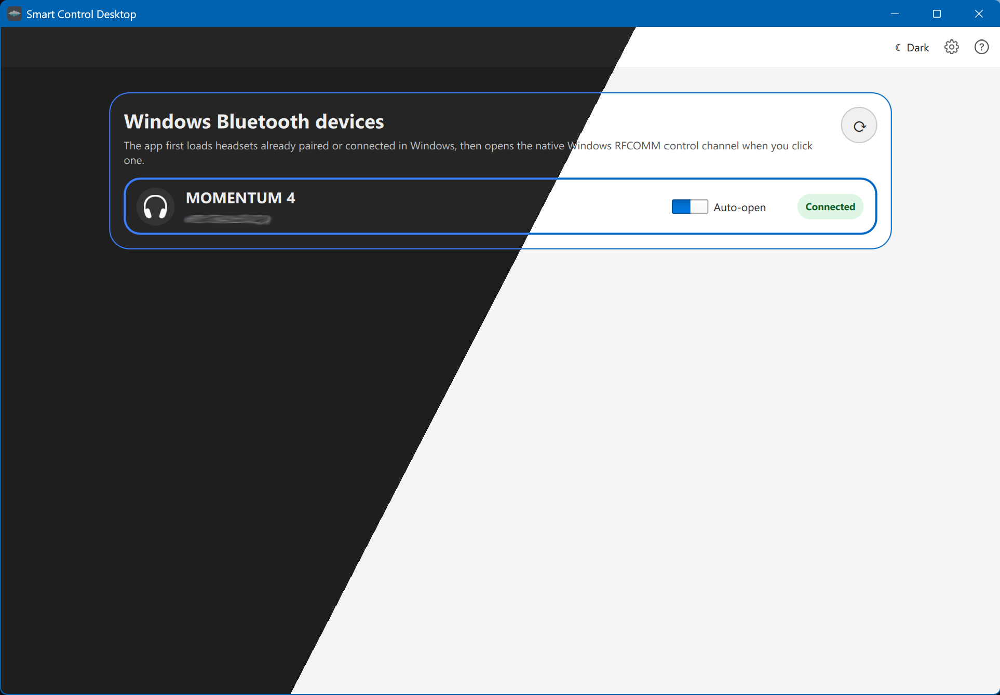
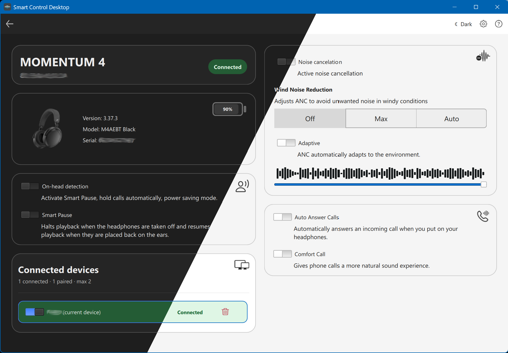
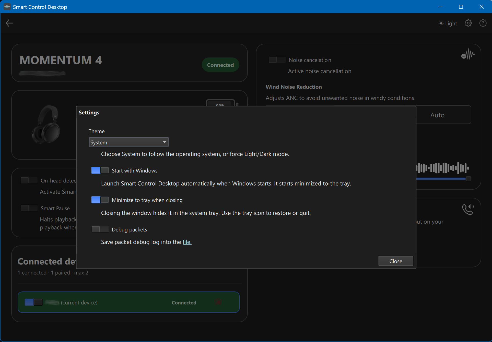

# Sennheiser Desktop Client

An unofficial Windows desktop client for the Sennheiser Smart Control app.

## Overview

Sennheiser Desktop Client is an unofficial desktop application for controlling supported Sennheiser headphones from Windows.

Currently, the app supports **Sennheiser Momentum 4** headphones on **Windows**.

> This project is Windows-only. The CMake project intentionally stops configuration on non-Windows platforms.

## Screenshots

### Main Screen



### Settings Screen



### Preferences Screen



## Build Requirements

Install the following before building the project:

- **Windows 10 or Windows 11**
- **Git**
- **CMake 3.21 or newer**
- **Visual Studio with MSVC C++ tools**
  - Install the **Desktop development with C++** workload
  - The project uses C++17
- **Qt 6.5 or newer for MSVC 64-bit**
  - Required Qt modules: Core, Gui, Widgets, Quick, QuickControls2, Svg, Test, Qml, and QmlIntegration
- **Python 3**
  - Required by the build to generate GAIA property classes from `gaiaV3/m4.json`
- Optional but recommended:
  - **Ninja** build system
  - **Qt Creator** or Visual Studio CMake integration

## Build Steps

### 1. Clone the repository

```shell
git clone <repository-url>
cd sennheiser-desktop-client
```

Replace `<repository-url>` with the URL of this repository.

### 2. Open the project in Visual Studio

Open the cloned folder in Visual Studio using:

```text
File > Open > Folder...
```

Visual Studio should detect the CMake project automatically.

### 3. Configure Qt

Make sure CMake can find your Qt installation.

The easiest option is to set the `QTDIR` environment variable to your Qt MSVC directory, for example:

```shell
set QTDIR=C:\Qt\6.5.0\msvc2019_64
```

Or pass Qt directly to CMake with `CMAKE_PREFIX_PATH`:

```shell
cmake -S . -B build -DCMAKE_PREFIX_PATH=C:\Qt\6.5.0\msvc2019_64
```

Use the path that matches your installed Qt version and compiler kit, such as `msvc2019_64` or `msvc2022_64`.

### 4. Configure the project

From a Developer Command Prompt, PowerShell, or Visual Studio terminal:

```shell
cmake -S . -B build -DCMAKE_BUILD_TYPE=Release
```

If Qt is not found automatically, include `CMAKE_PREFIX_PATH`:

```shell
cmake -S . -B build -DCMAKE_BUILD_TYPE=Release -DCMAKE_PREFIX_PATH=C:\Qt\6.5.0\msvc2019_64
```

### 5. Build the project

```shell
cmake --build build --config Release --parallel
```

The executable is generated under the build output directory. The build also runs Qt deployment steps when `windeployqt` is available.

## Debug Build

To create a debug build:

```shell
cmake -S . -B build -DCMAKE_BUILD_TYPE=Debug
cmake --build build --config Debug --parallel
```

## Clean Build

To remove generated build files and start over:

```shell
rmdir /s /q build
rmdir /s /q out
```

Then configure and build again.

## Notes

This project is not affiliated with, endorsed by, or supported by Sennheiser.

Sennheiser and Momentum are trademarks of their respective owners.
